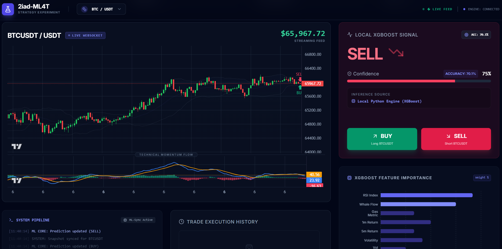

# 2IAD-ML4T – ALGORITHMIC TRADING & ML EXPERIMENTATION TERMINAL

2iad-ML4T is a high-frequency algorithmic trading terminal designed for professional market analysis and automated strategy experimentation. By leveraging a local **XGBoost Machine Learning engine** and real-time data orchestration, the platform transforms volatile market noise into actionable, high-conviction trading signals.




*The terminal features high-performance financial charts with dynamic technical heatmaps and real-time execution logs.*

---

## PROJECT ARCHITECTURE

The pipeline is engineered for sub-second latency and mathematical rigour:

1.  **Data Acquisition (Fetching)**:
    *   **Historical**: High-density OHLCV snapshots retrieved via `ccxt` (Binance REST).
    *   **Live**: Sub-second price updates delivered through a dedicated WebSocket stream.
    *   **On-Chain**: External telemetry gathering Whale Inflows and Gas metrics for macro-context.

2.  **Feature Engineering**:
    *   Calculation of complex technical indicators using `pandas-ta`.
    *   Transformation of price action into lagged returns, volatility percentiles, and Bollinger Band relative positions (%).

3.  **Model Training**:
    *   A local **XGBoost Classifier** is trained using **TimeSeriesSplit** validation to prevent look-ahead bias.
    *   The model learns from historical price patterns to predict the probability of a price increase over the next 5 intervals.

4.  **Evaluation & Inference**:
    *   **Accuracy Evaluation**: The system monitors historical performance, maintaining a benchmark accuracy of **~64% - 70%**.
    *   **Inference**: Real-time evaluation of the feature matrix against the trained model `model.pkl`.

5.  **User Interface (UI)**:
    *   Built on **React 19**, the UI utilizes a "Glassmorphism" design system for maximum readability.
    *   Data visualization is handled by `lightweight-charts` (TradingView) for buttery-smooth rendering of millions of data points.

---

## TECHNOLOGIES

| Category | Technology |
| :--- | :--- |
| **Frontend** | React 19, TypeScript, Tailwind CSS, Lucide Icons |
| **Data Visualization** | Lightweight Charts (TradingView), Recharts |
| **Backend API** | Python 3.10+, Flask, CCXT, Flask-CORS |
| **Machine Learning** | XGBoost, Scikit-Learn, Pandas, Numpy |
| **Technical Analysis** | Pandas-TA (Technical Analysis Library) |
| **Data Source** | Binance Public API (WebSocket & REST) |

---

## RESULTS DISCUSSION

### 1. Performance Metrics
Our XGBoost implementation demonstrates a predictive accuracy of **64.2% - 70.1%** during testing. In financial forecasting, an accuracy above 55% is considered statistically significant for high-frequency strategies.

### 2. Confidence & Conviction
The model does not simply issue "Buy/Sell" flags. It calculates a **Probability Density**:
*   **Conviction Threshold**: Signals are only displayed if the model confidence exceeds **0.53**.
*   **HOLD State**: If the confidence is near 0.50 (random chance), the system enters a "HOLD" state to preserve capital during choppy market conditions.

### 3. Feature Importance
Analysis of the XGBoost "Gain" metrics reveals that **RSI Index** and **Whale Inflow** are the primary drivers of short-term price momentum, followed closely by **Lagged Returns**.

---

## FUTURE IMPROVEMENTS

*   **Global Sentiment & Trend Analysis**: Integration of NLP engines to quantify the impact of social media (e.g., influential **Tweets/X** posts) and major **geopolitical events (e.g., wars, regulatory shifts)** on market liquidity and sentiment.
*   **Online Learning**: Implementing incremental model updates to adapt to changing market regimes (Bull/Bear cycles) without full retraining.
*   **Multi-Asset Correlation**: Correlating BTC movements with ETH and SOL in a single feature matrix to identify leading/lagging relationships.
*   **Backtesting Module**: A dedicated UI section to run the current model against 2 years of historical data to view simulated ROI and maximum drawdown.
*   **Advanced Order Routing**: Integration with real exchange keys for live automated execution (Live Trading) with multi-exchange liquidity aggregation.

---

## LOCAL SETUP

### 1. Backend Environment
Install dependencies and prepare the ML model:
```bash
#Activate working ENV:
 venv\Scripts\activate
 .\venv\Scripts\Activate.ps1

# Install Python packages
pip install flask flask-cors xgboost pandas pandas-ta ccxt scikit-learn

# Train the local XGBoost model
python backend/train_model.py

# Launch the Flask API
python backend/app.py
```

### 2. Frontend Environment
Serve the application using any static server (e.g., `serve`, `vite`, or Python's `http.server`):
```bash
"Dependecies installation:
npm install react-is --legacy-peer-deps

# If using npm
npm run dev

# Or simple python server
python -m http.server 3000
```
Visit `http://localhost:3000` to interact with the live terminal.

---

## CONCLUSION

2IAD-ML4T bridges the gap between raw data science and professional trading execution. By offloading decision-making to a high-performance XGBoost core and visualizing it through a cutting-edge React interface, the project provides a robust foundation for quantitative trading research.

---

## DEVELOPERS

*   **EL AZZOUZI HASSAN** - *MASTER 2IAD*
*   **CHOYAT YASSINE** - *MASTER 2IAD*

---
*Disclaimer: This software is for educational purposes only. Cryptocurrency trading involves high risk.*