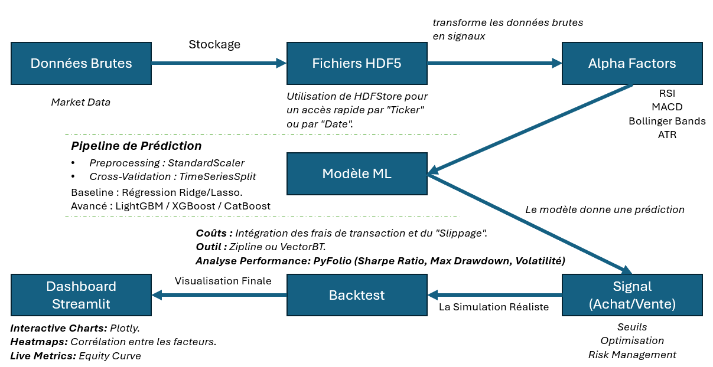

# 2IAD-ML4T: The ML4T Journey
### From Theoretical Frameworks to Live Crypto Execution

This repository documents the evolution of a trading experiment, inspired by **Stefan Jansen's "Machine Learning for Algorithmic Trading"** workflow. It traces the path from raw financial data engineering to the deployment of a high-performance, real-time trading terminal for cryptocurrency markets.

---

## Repository Structure

The project is organized into three distinct phases representing the maturity of the research:

### 1. [Introduction & Stefan's Workflow](./1_Introduction_stefan_workflow)
Foundational study of Jansen's methodology. This section covers the initialization of data pipelines, understanding Alpha factors, and setting up the environment for institutional-grade ML research.

### 2. [Building Blockchain Workflows](./2_Builing_new_workflow_for_blockchain)
The adaptation phase. Here, the traditional equity-focused ML workflow is translated to the high-volatility environment of Blockchain. 
- **Data Engineering**: Implementing HDF5 storage for ultra-fast access to tick-level crypto data.
- **Factor Research**: Adapting technical indicators (RSI, MACD, Bollinger Bands) to capture crypto-specific momentum regimes.

### 3. [2IAD - ML4T](./3_web-application)
A full-stack web application featuring:
- **XGBoost Inference Engine**: Local Python backend for sub-second signal generation.
- **Real-Time Visualization**: React-based dashboard with TradingView integration.

---

## Conceptual Flux Schema

The repository follows a rigorous end-to-end quantitative pipeline as visualized in our research phase:



1.  **Données Brutes (Raw Data)**: Orchestrating Binance REST/WS feeds.
2.  **Stockage (Storage)**: Utilizing HDFStore for rapid "Ticker/Date" indexed retrieval.
3.  **Alpha Factors**: Engineering RSI, MACD, Bollinger Bands, and ATR into a feature matrix.
4.  **Pipeline de Prédiction**: Using `StandardScaler` and `TimeSeriesSplit` to feed an **XGBoost** classifier.
5.  **Signal Generation**: Establishing conviction thresholds for Buy/Sell/Hold execution.
6.  **Realistic Simulation**: Backtesting with `VectorBT` or `Zipline`, accounting for fees and slippage.
7.  **Dashboard**: Final visualization and execution interface.

---

## Roadmap & Future Improvements

While the current terminal is functional, we are actively researching the following enhancements:
- **Geopolitical Sentiment Analysis**: Quantifying the impact of global conflicts and macro-events on asset liquidity using Gemini 3.0.
- **Social Media Alpha**: Integrating real-time "Tweets/X" sentiment as a primary feature in the XGBoost matrix to catch FOMO-driven price action.
- **Regulatory Monitoring**: Detecting regulatory shifts and news "Black Swans" before they hit the price action.

---

## Getting Started

To explore the final product, navigate to the web application directory:

```bash
cd 3_web-application
# Follow the specific setup instructions in the internal README
```

---

## Developers

This research and development cycle was led by:

*   **EL AZZOUZI HASSAN** - *MASTER 2IAD*
*   **CHOYAT YASSINE** - *MASTER 2IAD*

---
*Disclaimer: This repository is for educational and experimental purposes. Trading involves significant risk.*